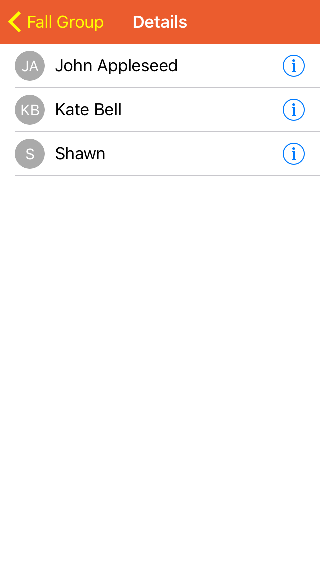
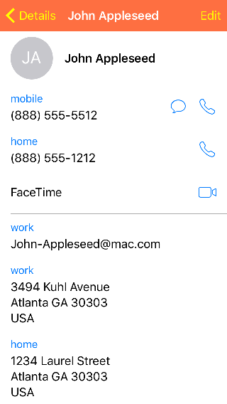

#FiresideChat Demo Project

FiresideChat is a project that uses WhatsApp as inspiration for its implementation, written in Objective-C.

Firebase is used as a backend service, and so the Firebase 3.0 iOS API is included as a Pod in the project.

##Setup

Before the project can be properly run, the Firebase database needs to be properly set up

###Creating a Firebase Project & Linking iOS Project to Firebase

First we need to link the iOS App with Firebase. If you already know how to do this, feel free to skip to the next section, "Adding Users to Firebase Database"

1. Sign up for a Firebase account at https://firebase.google.com using your Google account.

2. Once you've signed up, proceed to press Create A New Project and name the project whatever you'd like.

3. When the new Project has been created, the Overview screen (its typically the first screen presented) press the "Add Firebase to iOS" button. On the following screen will ask for the iOS application's bundle identifier. Copy the project's bundle identifier into the field and press "Add App". 

4. Firebase will automatically attempt to download a config file named "GoogleService-Info.plist". This file must be imported into the XCode project in order for the app to successfully connect to the Firebase server. The pod and initialization Code are already included in the project so these two steps can be skipped.

###Adding Users to Firebase Database

In the Firebase Console under the "Auth" section, make sure that the Email/Password sign in provider is enabled, since that is how users sign into the App.

In order to message another user in the app, the user must be:

 A) In your Contact List

 B) Registered in the Firebase database with the same phone number as they are listed in your phone's Contact List with. If said user in your Contact List has multiple phone numbers, at least one of them must match the number they've used to register their account.

The easiest way to add users to the firebase database is to test the app on two separate devices, each with their own accounts while making sure that the phone number used during registration are in the other account's contact list (so Account A's phone number should be in Account B's Contact List and vice versa).

The alternative is to add a user to the database manually:

1. Make sure that the root of the database has a child/field entitled "users". This field will contain the ids of all the users registered to the database

2. Add a randomly generated user Id and ensure that it contains a field titled "phoneNumber" with this user's phone number.

3. Now this user will show up as a registered/Favolirte user if the user's number is listed in the device's Contact List.

##Usage

###Registration

When first installed, this screen allows the user to register an account with the Firebase database, or log into an existing account.

###Favorites

When first installed, this screen is automatically populated with all the users
that are both in the user's Contact List and registered in the Firebase Database. 
Users may be added or removed from the list at any time. 
Only users that are registered with the database may be added to the list as Favorites.

Each row displays the name of the contact, their current status message (if they have one, otherwise "***no status***" will be displayed in that field), and the number type listed in their Contact Details..

Tapping on a name in the list takes you to the conversation thread between you and the user if such a thread currently exists, or creates a new one so the user can immediately begin to chat with said contact

Tapping on the Information accessory button will take you to that user's Contact Details screen.

###Contacts

This screen allows the user to browse all the users in their contact list as well as view the contact details for each contact

###Chats

Contains a list of all the currently ongoing chat threads of which this user is currently a participant of. Each row will display: 

1. The chat name if its a Group Chat (or the name of the other participant if just a thread between two users)

2. The date of the last received message for that chat.

3. The first line or so of the last received/sent message in that chat.

4. Number of new messages since that chat was last tapped into.

From this screen a user may: 

1. Tap on an existing thread to go to the Messages screen for this thread.

2. Compose a new thread between themselves and another user by  using the Compose Chat button at the top right of the navigation bar.

3. Compose a new Group Thread by pressing the New Group button.

4. Delete a thread from their device.

###New Group

This screen is presented to the user after the user taps the New Group button in the Chats screen. 

This screen allows the user to give the new group a name no longer than 25 characters in length. After the user is happy with their Group title, they can proceed to the Add Participants screen.

###Add Participants

This screen allows the user to add other users as participants to the Group chat. Only users that are registered with the Firebase database may be added as Participants to the chat.

Atleast 2 users must be selected in order to create the group chat. To create a chat with only one other participant, use the Compose New Chat Button in the top right hand corner of the Chat Screen. 

###Messages

This screen Lists all the messages received in this thread. From this screen a user may compose a new message, or check the Chat Details screen which will list the name of all the participants in the chat.

###Chat Details

 

This screen lists all the other participants in this chat. Tapping on the Information accessory Button of a row will take you to the Contact Details screen for that particular Contact.

##Future Improvements

1. Messages are currently stored  in the database indefinitely. Messages should be purged once all users of a chat have received the message or when a certain amount of time has passed. Since no backend code can be run on the firebase server, I suspect that the desired behavior might require a custom backend server.

2. Add functionality for a user to modify their status.

3. Add functionality to send photos through messages.

4. Add Location awareness.
